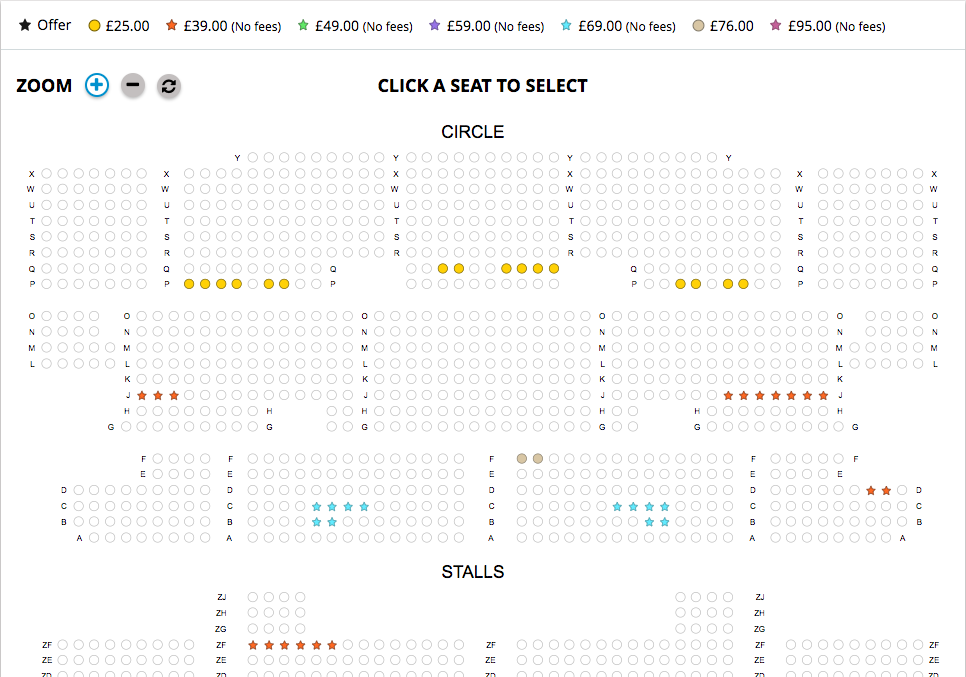

# Encoretickets pair test

The goal of this test is to have a technical conversation while implementing 
a solution to a user problem: Seats lumping. This exercise is to be seen as an algorithm
Kata, there is no need to create a web application.

First we're going to explain the domain of our problem and then expose the
desired solution.

## Seat lumping domain

We're selling tickets for shows, they can be Theatre, Musicals, Music Concert etc...
Let's have a look at our ubiquitous language.

- A show is defined by a product (example: Wicked), a date and a time.
- A ticket is defined by a show and a seat (example: row A, number 3).

A customer can select a lump of seats on a venue seat plan.

- A lump is a series of adjacent seats within a group of seats.
- A group of seats is a series of adjacent seats of a specific price, they belongs
to one area in the venue.
- An area is a part of venue which contains a list of seat groups (example: CIRCLE, STALLS).

The seat plan is displayed with all seats. Available seats groups are displayed
with a specific color depending on the price.



You can find an example of a list of available seat groups for a show from our
Inventory API in the file `availability.json`

You can retrieve the data with our Mock http client like this:

```
$client = new MockInventoryHttpClient();
$responseBody = $client->request('GET', '/availability/products/1587/quantity/2/seats?date=20190111&time=1930');
```

## The problem

Provided the above example of data, we would like to be able to give a list of possible
seat lumps given a number of desire seats that satisfy the following policy.

### Lump policy

In order to maximise the number of tickets that can be sold for a show, we cannot sell
a lump of seats that result of making orphan seats.

Examples: 
Group of seats: A1, A2, A3, A4
For a lump size of 2, we can sell: (A1, A2) or (A3, A4) but not (A2, A3) 
as it will result of leaving only one seat in A1 and only one seat in A4.
 
